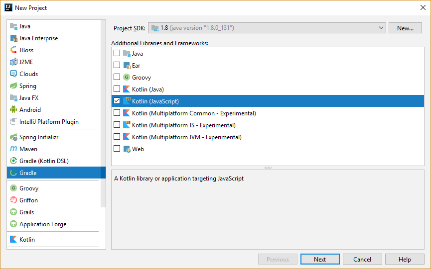
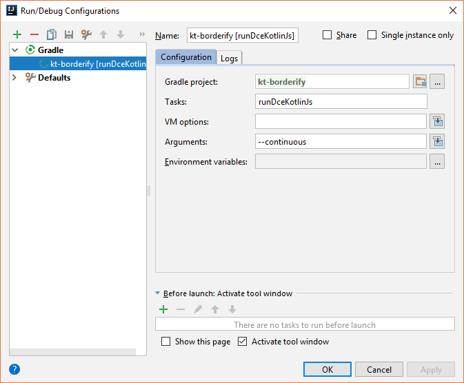
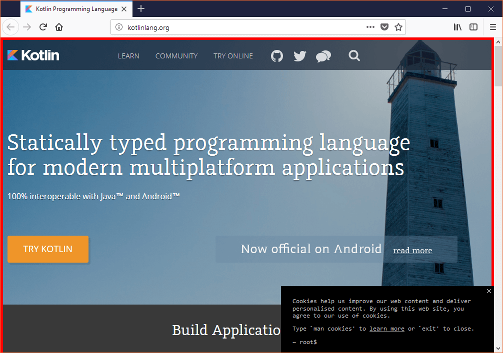

Kotlin, my favourite programming language, has seen a fast adoption on platforms like Android or Server where the code is compiled to Java bytecode. However, as Kotlin also supports compilation to Javascript, the language is starting to receive attention in the Web ecosystem as well.

While some content on writing web applications in Kotlin has been published, the niche of writing browser extensions has seemed to be ignored until now. That’s why in this post we are going explore the process of writing a simple extension for Firefox using Kotlin JS.

The extension is based on [Your first extension](https://developer.mozilla.org/en-US/Add-ons/WebExtensions/Your_first_WebExtension) by Mozilla and will simply add a red border to the [kotlinlang.org](https://kotlinlang.org) website.

## Requirements

For testing our Firefox extension, we will use the [web-ext](https://developer.mozilla.org/en-US/Add-ons/WebExtensions/Getting_started_with_web-ext) tool from Mozilla. To obtain it you need to install [node.js](https://nodejs.org/) and then run the following command in a terminal:

```bash
npm install --global web-ext
```

Apart from that, we will be using IntelliJ IDEA 2017.2.6 with the Kotlin plugin version 1.1.60 to develop the extension.

## Setting up the project

In Intelli IDEA, we create a new Gradle based project and check the **Kotlin (JavaScript)** option.



We proceed through the wizard until the empty project is created and opened.

As the next step, we will enable the Dead Code Elimination plugin for Kotlin JS. This is necessary because a Kotlin JS program needs to bundle the Kotlin stdlib which is over a megabyte in size. However, we can reduce the size of our compiled code drastically by removing code that’s never getting called.

To enable the plugin, simply add the following line to the build.gradle file.

```groovy
apply plugin: 'kotlin-dce-js'
```

### Creating the extension manifest

In the next step, we add the manifest file which is required for a Firefox extension. This file is called manifest.json and resided in the root directory of our project. The file should have the following content.

```json
{
  "manifest_version": 2,
  "name": "Kotlin Borderify",
  "version": "1.0",
  "description": "Adds a red border to kotlinlang.org",
  "content_scripts": [
    {
      "matches": [
        "*://kotlinlang.org/*"
      ],
      "js": [
        "build/classes/kotlin/main/min/kotlin.js",
        "build/classes/kotlin/main/min/kt-borderify.js"
      ]
    }
  ]
}
```

In this file we declare that our extension will inject a content script in any website matching the pattern `*://kotlinlang.org/*` . The necessary script files are are the Kotlin stdlib `kotlin.js` as well as our code in the `kt-borderify.js` file.

## The code

Next, we create a file main.kt in the src/main/kotlin directory. This code will be run, whenever a matching site will be loaded. The entry point for our code is a standard main function. Inside it, we access the body of the document and apply a border style.

```kotlin
import kotlin.browser.document

fun main(args: Array<String>) {
    document.body?.style?.border = "5px solid red"
}
```

The code inside the main function is similar to the corresponding Javascript code. However, we see that because the `body` of a document can be absent, the type system is forcing us to use the safe-call operator `?.` to prevent an exception. This is a glimpse of the language features that Kotlin provides to make developing in it eaiser and the resulting code safer.

## Testing the extension

Now it’s time to test our extension. First, we need to compile our code and shrink it by eliminating dead code. This is done by running the Gradle task `runDceKotlinJs` . We run the task in continous mode so that when we make addtional changes to the code, it gets recompiled immediately.

You can run the Gradle task from IntelliJ IDEA by creating a run configuration like so



or from the command line by running

```bash
./gradlew runDceKotlinJs --continuous
```

Next, we use the web-ext tool start a new Firefox instance with our extension installed by running

```bash
web-ext run
```

from a terminal. Hint: IntelliJ IDEA has a [built-in terminal](https://www.jetbrains.com/help/idea/working-with-embedded-local-terminal.html).

In the just launched browser, we navigate to [kotlinlang.org](https://kotlinlang.org). We are greeted with a beautiful red border to demonstrate that the extension is working.



Now, let’s change the color of the border from red to green. To do so, we modify our code to

```kotlin
document.body?.style?.border = "5px solid green"
```

When we switch back to Firefox, we see (after a short delay) that our changes are automatically applied without us having to run any commands.

## Conclusion

In this post we saw how to write a simple Firefox extension in Kotlin JS that injects a content script. The setup was fairly easy and we didn’t hit any major roadblocks. Additionally, the workflow including continuous building and live reloading the extension turned out to be pretty comfortable.

In the follow-up post [Your Second Firefox extension in Kotlin](/blog/your-second-firefox-extension-in-kotlin/) I’m diving deeper in the extension development process and show how to call Browser APIs.
