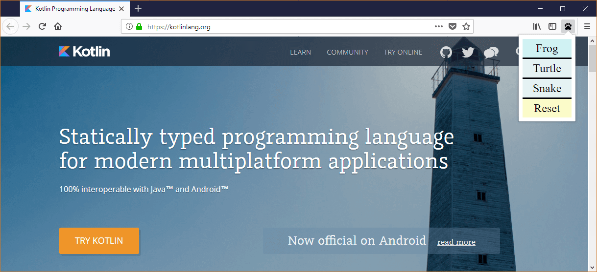

This post is the sequel [Your First Firefox (Web)extension in Kotlin](/blog/your-first-firefox-web-extension-in-kotlin/). You should read it for the requirements and the basic setup of a Firefox extension written in Kotlin.

In this post we are going to rewrite [Your second extension](https://developer.mozilla.org/en-US/Add-ons/WebExtensions/Your_second_WebExtension) from the Mozilla tutorials in Kotlin. The extension consists of a toolbar button with a popup that allows you to replace the current tab’s content with an image of a beast.

The interesting bit about this addon is that, unlike the previous one, it needs to interface with the WebExtensions API. We will explore two possibilities to do this, one type safe but a bit tedious way and one dynamic way that involves less typing.

Note: You can get the complete project over at https://github.com/cypressious/second-firefox-extension-kotlin.

## The extension

The main entry to our extension is a toolbar button. When clicking the button, a popup is shown where you can select the beast you want to show.



Because extension scripts run isolated from the content process, a script running in a toolbar popup can’t manipulate the DOM of a tab directly. That’s why we require a second content script that is injected in the current tab which handles the DOM manipulation. The two scripts will then communicate via messages.


## The setup

As required for all extensions, we need to declare a `manifest.json` that tells the browser about the capabilities of our extension.

```json
{
  "manifest_version": 2,
  "name": "Beastify",
  "version": "1.0",
  "permissions": [
    "activeTab"
  ],

  "browser_action": {
    "default_icon": "icons/beasts-32.png",
    "default_title": "Beastify",
    "default_popup": "popup/choose_beast.html"
  },

  "web_accessible_resources": [
    "beasts/frog.jpg",
    "beasts/turtle.jpg",
    "beasts/snake.jpg"
  ]
}
```

### The first obstacle

As discussed earlier, our extension will consist of two separate script files. However, this poses a small problem because the Kotlin JS compiler merges all the Kotlin code to a single JS file. [KT-6168](https://youtrack.jetbrains.com/issue/KT-6168) tracks the feature request to allow compiling to multiple files.

To overcome this limitation we will create two modules, one containing the popup script and one containing the content script. Here are the `build.gradle` and `setting.gradle` files required for the setup:

```groovy
// build.gradle

buildscript {
    ext.kotlin_version = '1.1.60'

    repositories {
        mavenCentral()
    }
    dependencies {
        classpath "org.jetbrains.kotlin:kotlin-gradle-plugin:$kotlin_version"
    }
}

version '1.0-SNAPSHOT'

allprojects {
    apply plugin: 'kotlin2js'
    apply plugin: 'kotlin-dce-js'

    repositories {
        mavenCentral()
    }

    dependencies {
        compile "org.jetbrains.kotlin:kotlin-stdlib-js:$kotlin_version"
    }

    compileKotlin2Js {
        kotlinOptions.sourceMap = true
        kotlinOptions.sourceMapEmbedSources = "always"
    }
}
```

```groovy
// settings.gradle

rootProject.name = 'kt-beastify'

include ':popup', ':content_script'
```

The Kotlin code will be placed in `popup/src/main/kotlin` and `content_script/src/main/kotlin`.

## Implementing the popup

In the `manifest.json` we declared that our extension has a toolbar button and that clicking it will show a popup whose layout is located in `popup/choose_beast.html`.

```html
<!DOCTYPE html>
<html>
<head>
    <meta charset="utf-8">
    <link rel="stylesheet" href="choose_beast.css"/>
</head>

<body>
    <div id="popup-content">
        <div class="button beast">Frog</div>
        <div class="button beast">Turtle</div>
        <div class="button beast">Snake</div>
        <div class="button reset">Reset</div>
    </div>
    <div id="error-content" class="hidden">
        <p>Can't beastify this web page.</p>
        <p>Try a different page.</p>
    </div>
    <script src="build/classes/kotlin/main/min/kotlin.js"></script>
    <script src="build/classes/kotlin/main/min/popup.js"></script>
</body>
</html>
```

Even though we write our code in Kotlin, the HTML has to reference the compiled JS output as well as the mandatory `kotlin.js` stdlib.

### The Kotlin

The entry point to our code is a `main` function that runs when the popup is opened. It immediately injects the content script in the current tab and then listens for clicks in the popup.

```kotlin
const val SCRIPT_PATH = "/content_script/build/classes/kotlin/main/min"

fun main(args: Array<String>) {
    Promise.all(arrayOf(
            browser.tabs.executeScript(Script("$SCRIPT_PATH/kotlin.js")),
            browser.tabs.executeScript(Script("$SCRIPT_PATH/content_script.js"))
    ))
            .then({ listenForClicks() })
            .catch(::reportExecuteScriptError)
}
```

Injecting a script is asynchronous and returns a `Promise` which Kotlin JS supports out of the box.

### Working with external declarations - the static way

To interact with the `browser`, we use the top-level property browser which contains properties for all the different APIs. However, the Kotlin compiler can’t magically know about these declarations which is why we have to write them down first. For this usecase, the language offers the [`external modifier`](https://kotlinlang.org/docs/reference/js-interop.html#external-modifier).

```kotlin
external val browser: Browser

external class Browser {
    val tabs: Tabs
}

external class Tabs {
    fun executeScript(def: Script): Promise<List<Any>>
}

class Script(val file: String)
```

The process of writing these sorts of declarations is basicly reading the [API documentation](https://developer.mozilla.org/en-US/Add-ons/WebExtensions/API/tabs/executeScript) and manually translating it to Kotlin. The translation is straight forward and we don’t have to declare properties we don’t use. For example, the parameter for `executeScript` has 6 different properties but because we only need the one named `file`, we omit the other 5.

The compiler can’t verify that the declarations are actually correct so it takes our word for it and lets the code compile.

**UPDATE**: To save you the work of typing the declarations yourself, you can now include the automatically generated declarations from https://github.com/cypressious/kotlin-webextensions-declarations.

### More Kotlin

Next, we implement the listening for clicks and sending a message to our content script.

```kotlin
fun listenForClicks() {
    document.addEventListener("click", { e ->
        val target = e.target as? Element ?: return@addEventListener

        browser.tabs.query(Query(active = true, currentWindow = true))
                .then({ tabs -> handleClick(target, tabs[0].id) })
                .catch(::reportError)
    })
}

fun handleClick(target: Element, id: Int) {
    if (target.classList.contains("beast")) {
        val url = getUrl(target.textContent)

        browser.tabs.insertCSS(id, CssDetails(CSS_HIDE_PAGE))
        browser.tabs.sendMessage(id, jsObject {
            command = "beastify"
            beastURL = url
        })
    } else {
        browser.tabs.removeCSS(id, CssDetails(CSS_HIDE_PAGE))
        browser.tabs.sendMessage(id, jsObject {
            command = "reset"
        })
    }
}

fun getUrl(name: String?): String {
    val relative = "beasts/${name?.toLowerCase()}.jpg"
    return browser.extension.getURL(relative)
}

const val CSS_HIDE_PAGE = """
    body > :not(.beastify-image) {
        display: none;
    }
"""

inline fun jsObject(init: dynamic.() -> Unit): dynamic {
    val o = js("{}")
    init(o)
    return o
}
```

We set a click listener for the whole document. When an element is clicked, we query the active tab (because we need the id when we want to send a message). We then call `handleClick` which shows or hides the content of the current tab and sends a message to show or hide the image of a beast.

Notice that [`browser.tabs.sendMessage`](https://developer.mozilla.org/en-US/Add-ons/WebExtensions/API/tabs/sendMessage) requires that the message parameter is a plain Javascript object. Kotlin JS doesn’t support Object literals ([KT-7935](https://youtrack.jetbrains.com/issue/KT-7935)) which is why we create a small helper function `jsObject` . We use the special built-in function [`js`](https://kotlinlang.org/api/latest/jvm/stdlib/kotlin.js/js.html) that translates a **constant** string to Javascript as-is. We then call an extension lambda on the object to initialize it and return it. The object has the special type `dynamic` meaning the compiler won’t perform any type checks and will let as us make any calls on it. We can use this to assign arbitrary properties. The resulting syntax on the call-site even looks a bit like an object literal.

The code depends on some more `external` declarations which you can find on [Github](https://github.com/cypressious/second-firefox-extension-kotlin/blob/master/popup/src/main/kotlin/helpers.kt).

# Implementing the content script

The content script runs directly in the tab and listens for messages from the popup. Here’s the whole code:

```kotlin
fun main(args: Array<String>) {
    if (window.asDynamic().hasRun == true) {
        return
    }
    window.asDynamic().hasRun = true

    browser.runtime.onMessage.addListener { message ->
        if (message.command === "beastify") {
            insertBeast(message.beastURL as String)
        } else if (message.command === "reset") {
            removeExistingBeasts()
        }
    }
}

fun insertBeast(beastURL: String) {
    removeExistingBeasts()

    val beastImage = document.createElement("img") as HTMLElement
    beastImage.run {
        setAttribute("src", beastURL)
        style.height = "100vh"
        className = "beastify-image"
    }

    document.body?.appendChild(beastImage)
}

fun removeExistingBeasts() {
    val existingBeasts = document.querySelectorAll(".beastify-image")

    for (beast in existingBeasts.asList()) {
        beast.parentNode?.removeChild(beast)
    }
}
```

To prevent the script from running multiple times, we set a property `hasRun` of the `window` to `true`. We use the built-in function `asDynamic` to cast `window` to `dynamic` so that we can read and write arbitrary properties on it.

Next, we listen for messages and upon receiving them either display or remove an image of a beast.

### Working with external declarations - the dynamic way

Again, we need to call an API defined in the external property browser. As an alternative to writing the whole declaration, we can take a shortcut and simply declare

```kotlin
external val browser: dynamic
```

As we’ve already seen, this lets us make any calls on the object but we sacrafice any compile-time safety.

## Testing the extension

To launch an instance of Firefox with our extension installed, we run

```bash
./gradlew runDceKotlinJs — continuous
```
and

```bash
web-ext run
```

Changes to the code will be picked up nearly instantly.

### Debugging the content script

If we need to, we can also take a look at the code in the browser. To debug the content script, open the developer tools and click on **Debugger**. You should be able to see the (Kotlin!) code of the content script and even set breakpoints.


### Debugging the popup script

To debug the popup script, open `about:debugging` and click on “Debug” beneath your extension.


A new developer tools window should open. Make sure to toggle the visibility for popup scripts in the top-right corner.


Unfortunately, here we only see the generated JS code. There is an [open issue](https://bugzilla.mozilla.org/show_bug.cgi?id=1418798) on the Firefox bugtracker, so hopefully this is fixed soon.

For debugging other types of scripts, take a look at https://developer.mozilla.org/en-US/Add-ons/WebExtensions/Debugging.
Conclusion

In this post we saw how to write a moderately complex Firefox extension in Kotlin. During our journey we needed to solve a couple of problems:

- To generate multiple JS output files, we needed to make multiple modules.
- To call externally defined APIs we needed to either write the definitions by hand or to give up type safety.
- To create JS objects, we needed a magical function to write some plain JS

Aside from those, the coding experience was quite pleasant. Kotlin’s syntax and language features made the code concise and fun to write.

**UPDATE**: To make calling the WebExtensions API easier, I’ve created a tool that programmatically generates the declarations from the official schema. You can simply include the declarations by following the instructions at https://github.com/cypressious/kotlin-webextensions-declarations.
