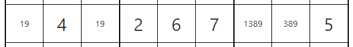
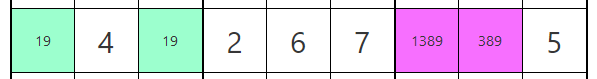
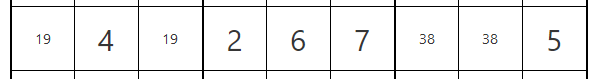
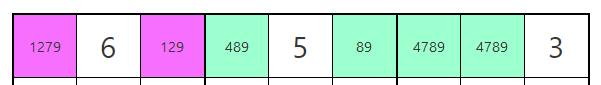
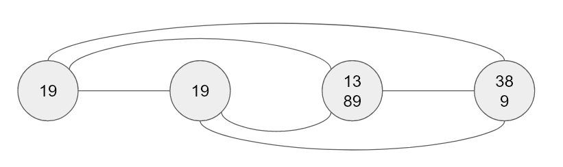
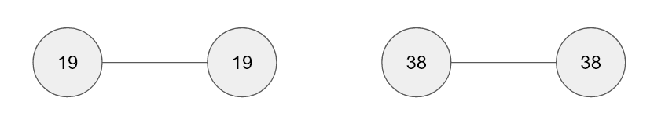
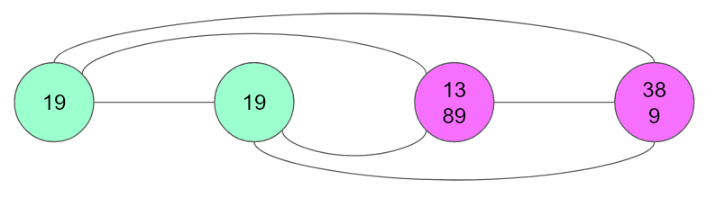
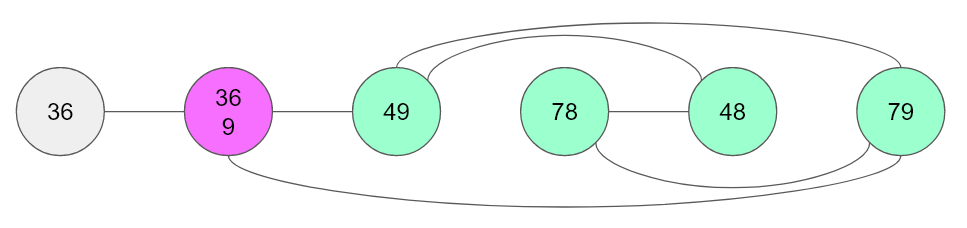

In a game of Sudoku you have to fill the numbers 1 to 9 in a 9x9 grid that is also divided into 3x3 boxes. Each row, column and box must contain each digit exactly once. A game starts with a number of given digits in the grid, and the player can use multiple techniques to deduct the missing digits.

Easy variants can usually be completed by using simple eliminations, i.e. all but one candidate are eliminated from a cell because the column, row or box already contains it. However, harder variants require using more complicated techniques where you eliminate candidates from cells in multiple steps.

Programming a Sudoku solver is not very difficult. Even though Sudokus are known to be [NP-complete](https://en.wikipedia.org/wiki/Mathematics_of_Sudoku#Mathematical_context), because the _n_ in a 9x9 Sudoku is fairly small, brute forcing a solution can be done in a few seconds. The more interesting task is to write a human-like Sudoku solver that uses human-possible techniques to identify the next move. In this post we'll discuss one technique that can be implemented using a fairly elegant graph algorithm. 

## The tuple technique

Consider the following row of a Sudoku. Completed cells contain one big number. The other cells contain remaining _candidates_ as smaller digits. 



Cells 1 and 3 of the row can only contain the digits 1 and 9. The two possible solutions are:

- 1 in cell 1 and 9 in cell 3 or
- 9 in cell 1 and 1 in cell 3.

From this we can deduce that the digits 1 and 9 can **never** appear in any other cell in this row. This means we can eliminate the candidates 1 and 9 from cells 7 and 8. From now on we'll mark tuples as colored in cyan, and the cells with possible eliminations colored in purple.



After the elimination, the 19-tuple is still there, but it's not _useful_ anymore because we can't deduce any more eliminations.



This technique isn't limited to pairs. The following image shows a 4789-quadruple (cyan). Accordingly, the candidates 7 and 9 can be eliminated from cells 1 and 3 (purple).



We can generalize the rule by defining a tuple as follows:

> A tuple is a subset of cells in a row, column or box with size **n** that contains **exactly n** distinct candidates.

So the elimination rule can be defined as follows:

> In a row, column or box with a tuple T, all candidates that are inside T can be eliminated from cells outside of T.

Furthermore, we define that a tuple T is _useful_ if T shares any candidates with cells outside of T.  

## Drafting an algorithm

Let's think of a naive algorithm to find tuples of size n with n distinct candidates. We have to consider tuples of all sizes with all possible candidate combinations:

```
for each row, column, box
    for each size n between 2 and 8 
        // 1 and 9 don't make sense
        for each subset of the digits 1 to 9 with size n
            for each ... 
``` 

It is easy to see that our implementation has to involve a lot of nested loops. That's not a problem per se, but I find it hard to visualize it and thus it's not straight forward for me to write down. Instead, let's look at the problem from a different angle.

Consider an undirected graph, where the vertices are the cells of the row, column or box (that don't have a solution filled in). For every two cells that _share_ a candidate, we'll add an edge. Let's look at our first example visualized as a graph:



A [component](https://en.wikipedia.org/wiki/Component_(graph_theory)) is a subgraph where all vertices are connected directly or indirectly. If you start at any cell you can construct the component it's part of using a breadth-first or depth-first search.

We can see that tuples _have to be_ part of a component as they need to share candidates[^1]. But how can we tell if the tuple is _useful_? Let's ask the opposite question: When is a tuple not useful? If it doesn't share any candidates with another cell, then the tuple must be _the whole_ component. Here's an example:



If, however, the tuple is part of a bigger component, then it must be useful, i.e. there are candidates that can be eliminated. In our original case, the tuple helps us eliminate 1 and 9 from the rest of the component.



Let's look at one more example. We can see that the 4789-quadruple allows us to eliminate the 9 from the purple vertex as they are part of a component.



With this knowledge at hand I found it relatively easy to write down the algorithm. Here's how it could look:

```
for each row, column, box C
    let g be a graph where cells in C are vertices
    
    for each cell c1 in g
        for each cell c2 in g
            if c1 and c2 share a candidate
                create an edge between c1 and c2

    while g is not empty
        let comp be any component in g
        
        for each subset s of comp
            if size of s == number of distinct candidates in s
            and size of s < size of comp
                return s  

        remove all vertices in comp from g
```

You can find my own implementation of the algorithm on [Github](https://github.com/cypressious/vue3-sudoku-solver/blob/master/src/logic/strategies/tuples.ts) and the runnable application at [sudoku-solver.rakhman.info](https://sudoku-solver.rakhman.info/).

## Footnotes

[^1] Technically, we can construct pseudo tuples that aren't connected where each cell only has one candidate, but then we could immediately enter the digit into that cell.
