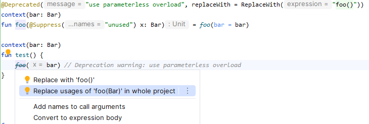

[Context parameters](https://github.com/Kotlin/KEEP/blob/context-parameters/proposals/context-parameters.md) are a new
preview feature in Kotlin 2.2 and supersede the experimental context receivers. In the Kotlin compiler codebase, we've
been using this new language feature for a short while, and here I'm sharing some patterns that have emerged so far.

## Bridge Methods

An important difference between context receivers and context parameters is that context parameters don't act as
implicit receivers.

```kotlin
class Foo {
    fun bar() {}
}

context(Foo) // context receivers syntax
fun testContextReceiver() {
    bar() // works
}

context(foo: Foo) // context parameters syntax
fun testContextParameter() {
    foo.bar() // `bar()` would be unresolved, we need to use an explicit receiver
}
```

This isn't a big deal when we want to call instance methods on the context parameter — we just need to use its name as
an explicit receiver of the call.

However, a problem arises with member extensions (extension functions or properties defined inside an interface or
class).

```kotlin
class Foo

class Bar {
    fun Foo.baz() {}
}

context(Bar) // context receivers syntax
fun Foo.testContextReceiver() {
    bar() // works
}

context(bar: Bar) // context parameters syntax
fun Foo.testContextParameter() {
    with(bar) { // we need to introduce an implicit receiver of type `Bar` into the scope
        baz()
    }
}
```

Introducing an implicit receiver using [`with`](https://kotlinlang.org/api/core/kotlin-stdlib/kotlin/with.html)
at every call-site adds boilerplate we'd like to avoid.

One approach is to convert the member extension `baz` into a contextual top-level extension function.

```kotlin
context(bar: Bar)
fun Foo.baz() { }

context(bar: Bar)
fun Foo.testContextParameter() {
    baz() // works
}
```

However, this only works when the method doesn't need to be overridden — a common use case for us. In this case, we can
duplicate the method as a top-level extension (the so-called **bridge method**) and delegate the implementation to the
interface.

```kotlin
interface Bar {
    fun Foo.baz()
}

class BarImpl1 {
    override fun Foo.baz() {}
}

class BarImpl2 {
    override fun Foo.baz() {}
}

context(bar: Bar)
fun Foo.baz() = with(bar) { baz() } // delegates to the member extension

context(bar: Bar)
fun Foo.testContextParameter() {
    baz() // works
}
```

We've traded some boilerplate at the call-site for boilerplate at the declaration-site. In practice, it's still 
worth it because the number of call-sites is typically larger.

The manual work of writing bridge methods looks like a good candidate for automation, e.g., using the IDE or a compiler
plugin.

## Holder Pattern

The value we'd like to pass around as a context argument needs to come from somewhere. Everything just works
when it's passed as a context parameter or extension receiver. In that case, the compiler will pick it up and
use it as a context argument for other calls.

```kotlin
context(bar: Bar)
fun Foo.baz() {}

context(bar: Bar)
fun test(foo: Foo) {
    foo.baz() // works
}

fun Bar.test(foo: Foo) {
    foo.baz() // also works
}
```

But sometimes we're working with a class where the value is stored in a property. To make the value available as
potential context argument, we need to bring it into scope, e.g., using the new [`context`](https://kotlinlang.org/api/core/kotlin-stdlib/kotlin/context.html) function.

```kotlin
context(bar: Bar)
fun Foo.baz() {}

class C(val bar: Bar) {
    fun test(foo: Foo) {
        context(bar) {
            foo.baz()
        }
    }
}
```

To get rid of this boilerplate, we can introduce a **holder** interface for our contextual type `Bar` that our classes
(typically more than one) can implement.

```kotlin
interface BarHolder {
    val bar: Bar
}

context(holder: BarHolder)
fun Foo.baz() {
    holder.bar // we can retrieve `Bar` from `holder`
}

class C(override val bar: Bar) : BarHolder {
    fun test(foo: Foo) {
        // the dispatch receiver `C` is a subtype of `BarHolder`,
        // and is used as a context argument
        foo.baz()
    }
}
```

This is really more of a workaround than a pattern, and the team is actively thinking about how to better accommodate
this use case. Follow [KT-79236](https://youtrack.jetbrains.com/issue/KT-79236/Class-properties-that-contribute-context-arguments-to-the-class-scope) for more updates. 

## Deprecated Overloads for Gradual Migration

Sometimes, we want to convert a parameter into a context parameter. We can use the **Change Signature** refactoring in
IntelliJ IDEA (support is available starting from 2025.2 though in 2025.3 it will be more mature), and it will migrate
all call-sites.

But sometimes we can't or don't want to migrate all call-sites immediately. In that case, we can introduce an overload
and let callers migrate gradually.

```kotlin
fun foo(bar: Bar) {}

context(bar: Bar)
fun foo() = foo(bar) // delegate to non-contextual overload

context(bar: Bar)
fun test() {
    // bar is available as a context argument
    // can be replaced with `foo()`
    foo(bar)
}
```

To detect call-sites that already have the required context argument in scope, we can introduce a third overload
that takes both a context parameter and a regular parameter and mark it as deprecated.

```kotlin
fun foo(bar: Bar) {}

context(bar: Bar)
fun foo() = foo(bar) // delegate to non-contextual overload

@Deprecated("use parameterless overload", replaceWith = ReplaceWith("foo()"))
context(_: Bar)
fun foo(x: Bar) = foo(bar = x)

context(bar: Bar)
fun test() {
    foo(bar) // Deprecation warning: use parameterless overload
}

fun test(bar: Bar) {
    foo(bar) // resolves to non-contextual overload, no deprecation warning.
}
```

Using IntelliJ IDEA, we can migrate all callers of the deprecated method inside our project to the parameterless
overload.



## Force Resolution to Non-Contextual Overload

When the compiler resolves a call and has the choice between a contextual and non-contextual overload, it will
prioritize the contextual one. This can be demonstrated by modifying the previous example.

```kotlin
fun foo(bar: Bar) {}

context(_: Bar)
fun foo(bar: Bar) {
    // both overloads are applicable, prioritizing the contextual one
    // oops, infinite recursion
    foo(bar)
}
```

We can force the compiler to resolve to the non-contextual overload by using different parameter names (as in the
example above) and using the named argument syntax.

```kotlin
fun foo(bar: Bar) {}

context(_: Bar)
fun foo(x: Bar) {
    // only one overload is applicable, no recursion
    foo(bar = x)
}
```

## Closing

Part of the reason why context parameters are released in preview is to collect problems like the ones highlighted in
this post. This way, the team can make adjustments and implement improvements before releasing them as stable.

Let us know in the [KEEP discussion](https://github.com/Kotlin/KEEP/issues/367) if you discovered any more problems or
share your favorite patterns in the Bluesky thread.